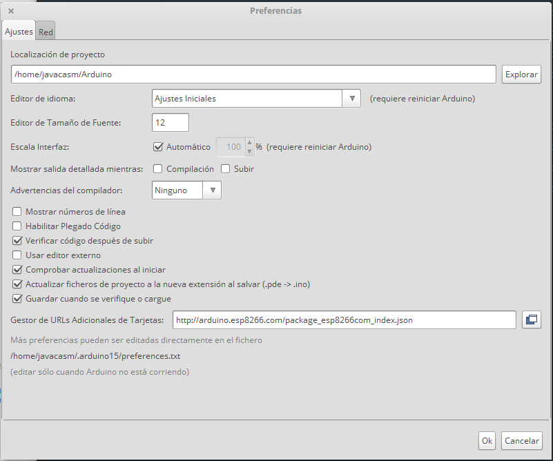
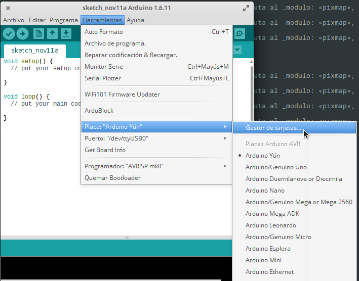
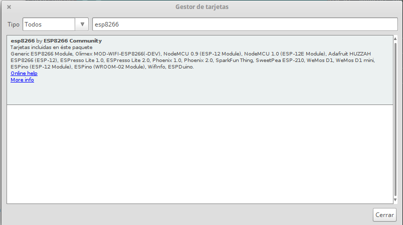

# ESP-Tutorial

## Instalación

En "Preferencias" (menú Ficheros) añadimos la url de la definición de las placas ESP

    http://arduino.esp8266.com/package_esp8266com_index.json

Ahora entramos en el "Gestor de Tarjetas" (en el menú Herramientas -> Placa)

Filtramos la selección de placas para que aparezcan las ESP8266 y pulsamos sobre instalar

## Enlaces
