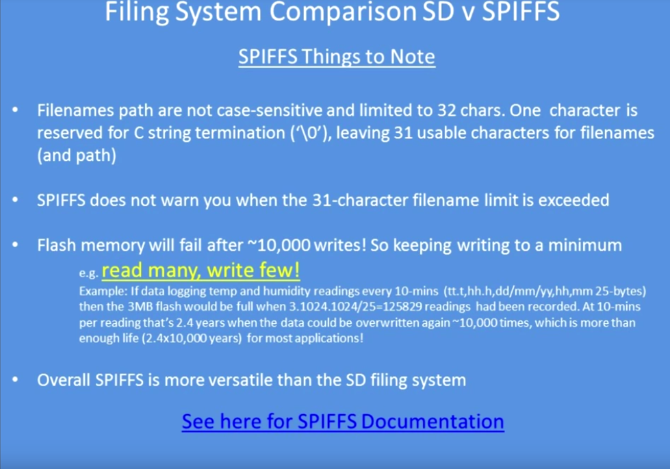

# SPIFFS

[Especificación del SPIFFS](https://github.com/esp8266/Arduino/blob/master/doc/filesystem.md)

[Ejemplo sencillo](http://www.esp8266.com/viewtopic.php?f=29&t=8194)

[Video tutorial sobre SPIFFS](https://www.youtube.com/watch?v=jIOTzaeh7fs)

## [Reemplaza la SD por el SPIFFS](https://www.youtube.com/watch?v=_UBPgdp1Yug)

[Ejemplos](https://github.com/G6EJD/SPIFFS-Examples)

## Aplicaciones

[FSBrowserNG](https://github.com/gmag11/FSBrowserNG): Servidor web con:
* ficheros en SPIFFS
* Autentificacion HTTP básica
* Editor de texto incluido

## Doc tecnicos

[Sobre el Sistema de archivos](https://github.com/esp8266/Arduino/blob/master/doc/filesystem.rst)

[Sobre SPIFFS](https://github.com/esp8266/Arduino/blob/master/cores/esp8266/spiffs/README.md)
